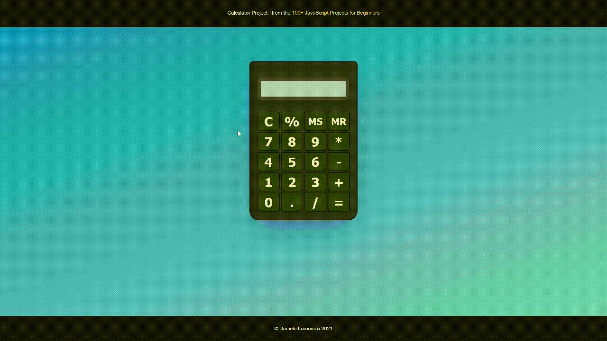
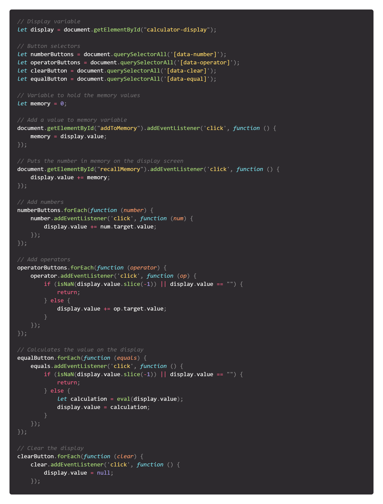

# Javascript Calculator Project

Challenge 10 from the [100+ Javascript projects page](https://jsbeginners.com/calculator-javascript-project/)

I took a week to figure out how to do this, because i was stuck on a simple problem, which i ended up resolving. 
I didn't think a calculator would be this hard to make. In this project i didn't do a scientific calculator but a simple one.
I also added Memory Store and Memory Clear buttons as a bonus.

Javascript code

