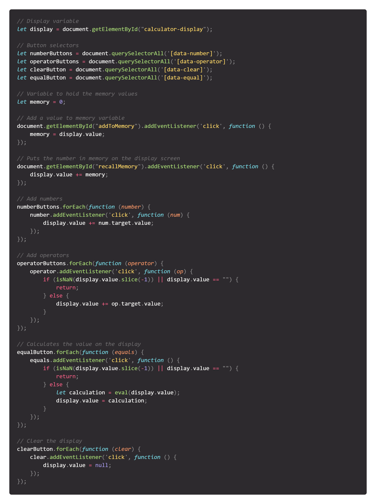

# Javascript Calculator Project

Challenge 10 from the [100+ Javascript projects page](https://jsbeginners.com/calculator-javascript-project/)

I took a week to figure out how to do this, because i was stuck on a simple problem, which i ended up resolving. 
I didn't think a calculator would be this hard to make. In this project i didn't do a scientific calculator but a simple one.
I also added Memory Store and Memory Clear buttons as a bonus.

## Javascript code

`
// Display variable
let display = document.getElementById("calculator-display");

// Button selectors
let numberButtons = document.querySelectorAll('[data-number]');
let operatorButtons = document.querySelectorAll('[data-operator]');
let clearButton = document.querySelectorAll('[data-clear]');
let equalButton = document.querySelectorAll('[data-equal]');

// Variable to hold the memory values
let memory = 0;

// Add a value to memory variable
document.getElementById("addToMemory").addEventListener('click', function () {
    memory = display.value;
});

// Puts the number in memory on the display screen
document.getElementById("recallMemory").addEventListener('click', function () {
    display.value += memory;
});

// Add numbers
numberButtons.forEach(function (number) {
    number.addEventListener('click', function (num) {
        display.value += num.target.value;
    });
});

// Add operators
operatorButtons.forEach(function (operator) {
    operator.addEventListener('click', function (op) {
        if (isNaN(display.value.slice(-1)) || display.value == "") {
            return;
        } else {
            display.value += op.target.value;
        }
    });
});

// Calculates the value on the display
equalButton.forEach(function (equals) {
    equals.addEventListener('click', function () {
        if (isNaN(display.value.slice(-1)) || display.value == "") {
            return;
        } else {
            let calculation = eval(display.value);
            display.value = calculation;
        }
    });
});

// Clear the display
clearButton.forEach(function (clear) {
    clear.addEventListener('click', function () {
        display.value = null;
    });
});
'
